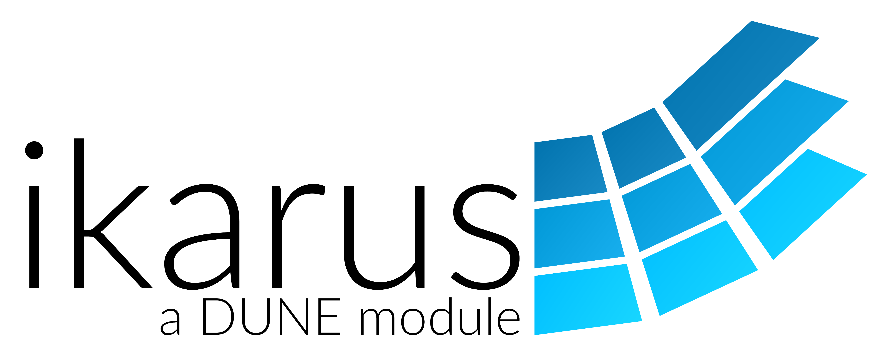

# Ikarus Teaching

[Ikarus](https://ikarus-project.github.io/) is a project developed by the Institute for Structural Mechanics, University of Stuttgart.
It strives to develop an easy-to-read and easy-to-use framework to perform finite element analysis.
It is heavily inspired by the finite element software [DUNE](https://dune-project.org/) (see also the
[book](https://www.springer.com/gp/book/9783030597016)),
[deal.II](https://www.dealii.org/), and [Kratos](https://github.com/KratosMultiphysics/Kratos).
Furthermore, it directly uses several modules from [DUNE](https://dune-project.org/).

This project, `ikarus-teaching`, aims to collect all the repositories meant for teaching purposes only.
